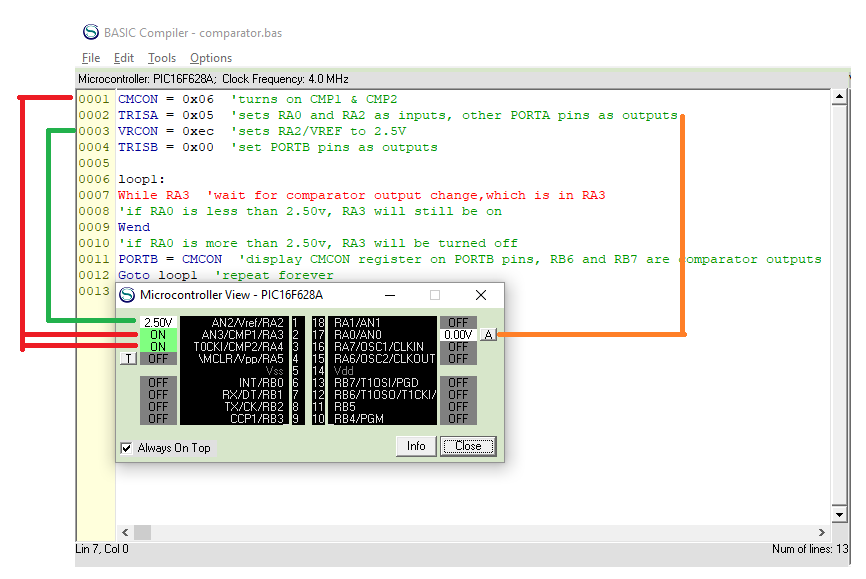
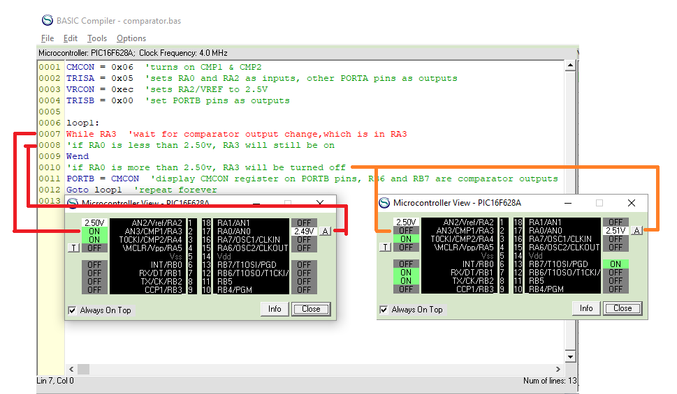
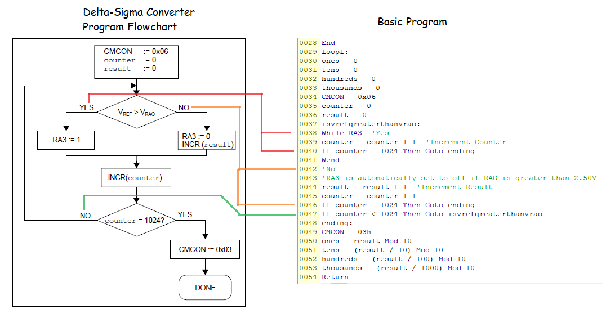
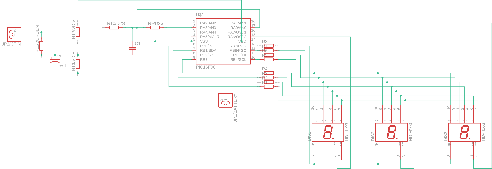
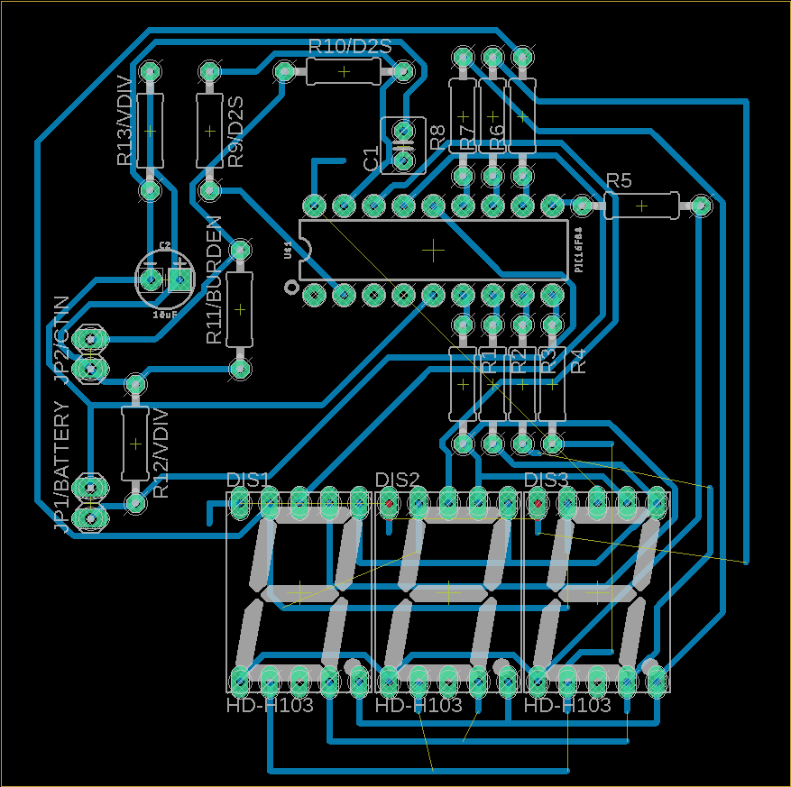
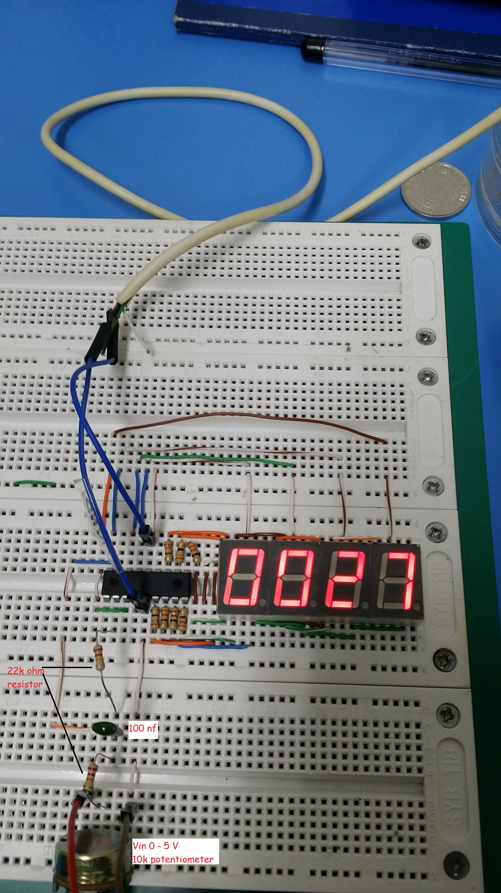

# PIC Wattmeter

A low-cost approach on a Wattmeter using a single-phase split-core current transformer and PIC16F628A. The prototype performed the most accuracy when the Input Voltage is around 4 to 5 Volts.

## Description

The project utilizes the built-in comparator of PIC16. The configuration charges to capacitors up to 2.5 Volts then discharges and recharges it for 1024 cycles to achieve a 10-bit resolution accuracy.

## Delta-Sigma Program

## Schematic

## Prototype

## Result

| voltmeter reading | adc voltage | adc reading |
| ----------------- | ----------- | ----------- |
| 1.98              | 2.04        | 409         |
| 1.96              | 2.09        | 419         |
| 1.96              | 2.09        | 419         |
| 1.97              | 2.09        | 419         |
| 1.97              | 2.09        | 419         |
| 1.97              | 2.09        | 419         |
| 1.97              | 2.09        | 419         |
| 1.98              | 2.04        | 409         |
